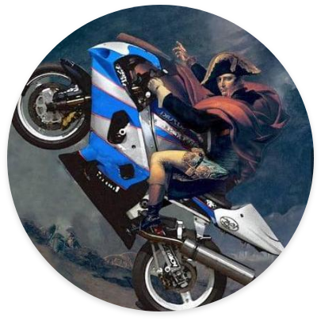

<h1>SISGEP</h1>

Projeto: Aplicações para Sustentabilidade

Sistemas de Informação

Pontifícia Universidade Católica de Minas Gerais

 

  Sistema Gerenciador de Projetos - Extensão Universitária
   
  <a href="Common/docs/Documentation.md">Documentação</a>
 ·   
  <a href="Common/docs/FrontDoc.md">React</a>

## Enredo:

Mussum Ipsum, cacilds vidis litro abertis. Per aumento de cachacis, eu reclamis.Interagi no mé, cursus quis, vehicula ac nisi.Não sou faixa preta cumpadi, sou preto inteiris, inteiris.Posuere libero varius. Nullam a nisl ut ante blandit hendrerit. Aenean sit amet nisi.

Si num tem leite então bota uma pinga aí cumpadi!Tá deprimidis, eu conheço uma cachacis que pode alegrar sua vidis.In elementis mé pra quem é amistosis quis leo.Mé faiz elementum girarzis, nisi eros vermeio.

Mé faiz elementum girarzis, nisi eros vermeio.Praesent vel viverra nisi. Mauris aliquet nunc non turpis scelerisque, eget.Interessantiss quisso pudia ce receita de bolis, mais bolis eu num gostis.Suco de cevadiss deixa as pessoas mais interessantis.

A ordem dos tratores não altera o pão duris.Nullam volutpat risus nec leo commodo, ut interdum diam laoreet. Sed non consequat odio.Admodum accumsan disputationi eu sit. Vide electram sadipscing et per.Aenean aliquam molestie leo, vitae iaculis nisl.

  
 

 
## Integrantes

